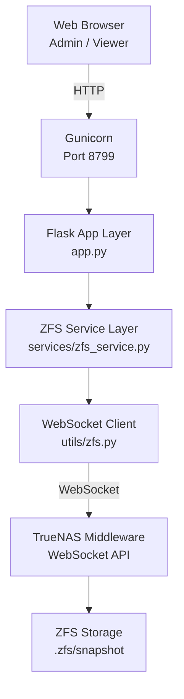
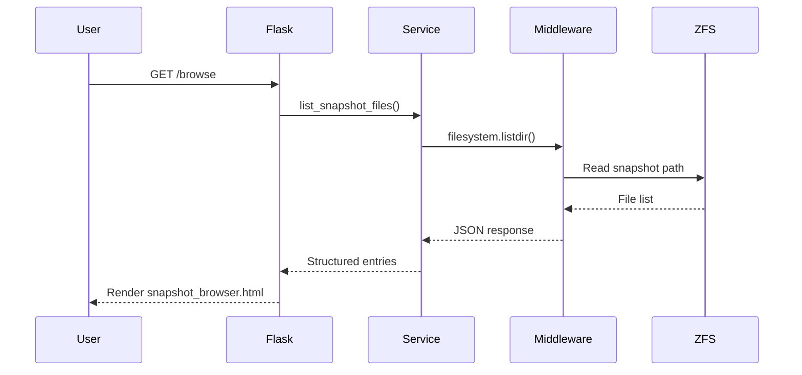
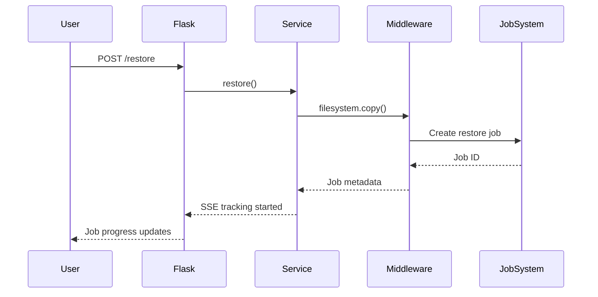
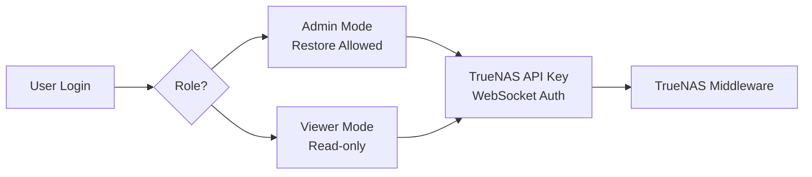

# ShadowPortal

ShadowPortal is a lightweight web interface for exploring, diffing, and restoring ZFS snapshots on TrueNAS systems.

It connects directly to TrueNAS middleware via the WebSocket API and provides a secure, role-based UI for browsing snapshot contents and managing restore operations.

Built for operators who want safe snapshot visibility without shell access.

---

## Features

- WebSocket authentication using TrueNAS API keys
- Dataset and snapshot discovery
- Snapshot browser with directory navigation
- Snapshot diff viewer
- File and directory restore via middleware jobs
- Role-based access control (admin / viewer)
- Audit logging of destructive operations
- Server-Sent Events job tracking
- Gunicorn-ready production deployment

---

## Architecture

ShadowPortal communicates directly with TrueNAS `middlewared` using the official WebSocket API.

- No SSH required
- No direct ZFS shell execution
- All operations executed through middleware calls

Snapshot browsing is performed via `filesystem.listdir` against `.zfs/snapshot` paths.

Restore operations use `filesystem.copy` jobs to ensure consistency and auditability.


## Architecture Overview


## Snapshot Browse Flow


## Restore Operation Flow


## Security Model


---

## Requirements

- TrueNAS SCALE (middleware WebSocket API enabled)
- Docker
- Python 3.12 (containerized)
- Valid TrueNAS API key

---

## Environment Variables

Create a `.env` file with:

```env
TRUENAS_URL=http://127.0.0.1:6000
TRUENAS_WS_URL=ws://127.0.0.1:6000/websocket
TRUENAS_API_KEY=YOUR_API_KEY
TRUENAS_VERIFY_TLS=false

FLASK_SECRET_KEY=change_this
SHADOWPORTAL_ADMIN_PASSWORD_HASH=bcrypt_hash_here
SHADOWPORTAL_VIEWER_PASSWORD_HASH=bcrypt_hash_here

CACHE_DEFAULT_TIMEOUT=30
```

---

## Deployment

```bash
docker compose up -d --build
```

Default port:

```
http://<host>:8799
```

---

## Security Model

- API key authentication to TrueNAS
- Role-based login (admin / viewer)
- Restore path validation to prevent `.zfs` writes
- Audit log for rollback, clone, and restore operations
- WebSocket session isolation per request

ShadowPortal is intended for controlled homelab and private infrastructure environments.

---

## License

MIT License

Copyright (c) 2026 Alex Decker

Permission is hereby granted, free of charge, to any person obtaining a copy
of this software and associated documentation files (the "Software"), to deal
in the Software without restriction, including without limitation the rights
to use, copy, modify, merge, publish, distribute, sublicense, and/or sell
copies of the Software, and to permit persons to whom the Software is
furnished to do so, subject to the following conditions:

The above copyright notice and this permission notice shall be included in all
copies or substantial portions of the Software.

THE SOFTWARE IS PROVIDED "AS IS", WITHOUT WARRANTY OF ANY KIND, EXPRESS OR
IMPLIED, INCLUDING BUT NOT LIMITED TO THE WARRANTIES OF MERCHANTABILITY,
FITNESS FOR A PARTICULAR PURPOSE AND NONINFRINGEMENT. IN NO EVENT SHALL THE
AUTHORS OR COPYRIGHT HOLDERS BE LIABLE FOR ANY CLAIM, DAMAGES OR OTHER
LIABILITY, WHETHER IN AN ACTION OF CONTRACT, TORT OR OTHERWISE, ARISING FROM,
OUT OF OR IN CONNECTION WITH THE SOFTWARE OR THE USE OR OTHER DEALINGS IN THE
SOFTWARE.
