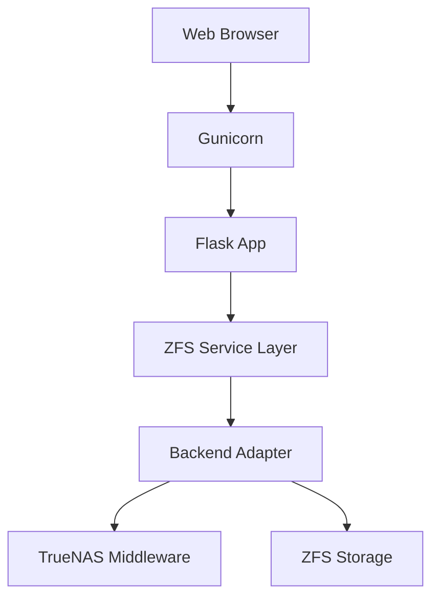

# ShadowPortal

ShadowPortal is a lightweight, backend‑agnostic web interface for exploring, diffing, and restoring ZFS snapshots.

It supports:

- TrueNAS middleware (WebSocket API)
- Generic Linux ZFS hosts

Built for operators who want safe snapshot visibility without shell access.

---

# Features

- Pluggable backend architecture (TrueNAS + Generic ZFS)
- WebSocket authentication using TrueNAS API keys
- Dataset and snapshot discovery
- Snapshot browser with directory navigation
- Snapshot diff viewer
- File and directory restore
- Role‑based access control (admin / viewer)
- Audit logging of destructive operations
- Capability‑aware UI behavior
- Backend health and introspection endpoints
- Gunicorn‑ready production deployment

---

# Backend Architecture

ShadowPortal abstracts backend operations behind a service layer.

Backends:

- TrueNASZFSService (middleware‑backed)
- GenericZFSService (local ZFS CLI)

Backend selection order:

1. FORCE\_BACKEND environment variable (if set)
2. TrueNAS WebSocket detection
3. Local zfs binary detection

Use `/backend-info` to verify which backend is active.

---

# Quick Start (No Clone Required)

## TrueNAS Backend

```bash
docker run -d \
  --name shadowportal \
  -p 8799:8799 \
  -e TRUENAS_URL=http://127.0.0.1:6000 \
  -e TRUENAS_WS_URL=ws://127.0.0.1:6000/websocket \
  -e TRUENAS_API_KEY=YOUR_API_KEY \
  -e TRUENAS_VERIFY_TLS=false \
  -e FLASK_SECRET_KEY=change_this \
  -e SHADOWPORTAL_ADMIN_PASSWORD_HASH=bcrypt_hash_here \
  -e SHADOWPORTAL_VIEWER_PASSWORD_HASH=bcrypt_hash_here \
  -e CACHE_DEFAULT_TIMEOUT=30 \
  -v /mnt:/mnt:ro \
  --restart unless-stopped \
  ghcr.io/alexdecker/shadowportal:latest
```

Access:

```
http://<host>:8799
```

---

## Generic ZFS Backend (Linux host with ZFS)

```bash
docker run -d \
  --name shadowportal \
  -p 8799:8799 \
  -e FORCE_BACKEND=generic \
  -e FLASK_SECRET_KEY=change_this \
  -e SHADOWPORTAL_ADMIN_PASSWORD_HASH=bcrypt_hash_here \
  -e SHADOWPORTAL_VIEWER_PASSWORD_HASH=bcrypt_hash_here \
  -v /mnt:/mnt:ro \
  --device /dev/zfs \
  --cap-add SYS_ADMIN \
  --restart unless-stopped \
  ghcr.io/alexdecker/shadowportal:latest
```

Notes:

- Generic backend requires access to `/dev/zfs`
- `/mnt` must reflect host dataset layout
- No TrueNAS middleware required

---

## TrueNAS SCALE Host Deployment (Host Networking)

```bash
docker run -d \
  --name shadowportal \
  --network host \
  -e TRUENAS_URL=http://127.0.0.1:6000 \
  -e TRUENAS_WS_URL=ws://127.0.0.1:6000/websocket \
  -e TRUENAS_API_KEY=YOUR_API_KEY \
  -e FLASK_SECRET_KEY=change_this \
  -e SHADOWPORTAL_ADMIN_PASSWORD_HASH=bcrypt_hash_here \
  -e SHADOWPORTAL_VIEWER_PASSWORD_HASH=bcrypt_hash_here \
  -v /mnt:/mnt:ro \
  --restart unless-stopped \
  ghcr.io/alexdecker/shadowportal:latest
```

---

# Clone + Compose Deployment

```bash
git clone https://github.com/alexdecker/shadowportal.git
cd shadowportal
docker compose up -d --build
```

Default port:

```
http://<host>:8799
```

---

# Environment Variables

Example `.env` file for Docker Compose:

```env
TRUENAS_URL=http://127.0.0.1:6000
TRUENAS_WS_URL=ws://127.0.0.1:6000/websocket
TRUENAS_API_KEY=YOUR_API_KEY
TRUENAS_VERIFY_TLS=false

FLASK_SECRET_KEY=change_this
SHADOWPORTAL_ADMIN_PASSWORD_HASH=bcrypt_hash_here
SHADOWPORTAL_VIEWER_PASSWORD_HASH=bcrypt_hash_here

CACHE_DEFAULT_TIMEOUT=30

# Optional override
FORCE_BACKEND=generic
```

---

# Backend Introspection

Verify active backend:

```
curl http://localhost:8799/backend-info
```

Structural health check:

```
curl http://localhost:8799/backend-health
```

---

# Architecture Overview



---

# Security Model

- Role‑based login (admin / viewer)
- API key authentication to TrueNAS
- Restore path validation
- Capability‑based UI restrictions
- Audit logging for destructive operations
- WebSocket session isolation

ShadowPortal is intended for controlled infrastructure environments.

---

# License

Copyright (c) 2026 Alex Decker


Permission is hereby granted, free of charge, to any person obtaining a copy

of this software and associated documentation files (the "Software"), to deal

in the Software without restriction, including without limitation the rights

to use, copy, modify, merge, publish, distribute, sublicense, and/or sell

copies of the Software, and to permit persons to whom the Software is

furnished to do so, subject to the following conditions:


The above copyright notice and this permission notice shall be included in all

copies or substantial portions of the Software.


THE SOFTWARE IS PROVIDED "AS IS", WITHOUT WARRANTY OF ANY KIND, EXPRESS OR

IMPLIED, INCLUDING BUT NOT LIMITED TO THE WARRANTIES OF MERCHANTABILITY,

FITNESS FOR A PARTICULAR PURPOSE AND NONINFRINGEMENT. IN NO EVENT SHALL THE

AUTHORS OR COPYRIGHT HOLDERS BE LIABLE FOR ANY CLAIM, DAMAGES OR OTHER

LIABILITY, WHETHER IN AN ACTION OF CONTRACT, TORT OR OTHERWISE, ARISING FROM,

OUT OF OR IN CONNECTION WITH THE SOFTWARE OR THE USE OR OTHER DEALINGS IN THE

SOFTWARE.
